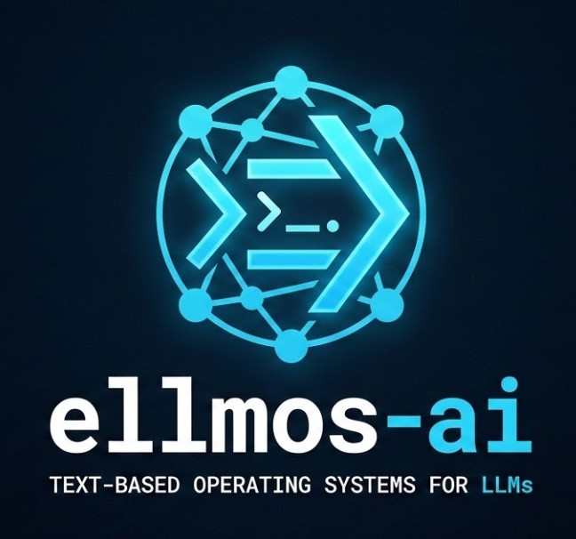

<p align="center">
  
</p>

# ellmos -- Extra Large Language Model Operating Systems

*From a spring to a stream -- LLM operating systems that flow.*


**ellmos** (XLLM-OS) is a family of text-based operating systems that empower Large Language Models to work autonomously, learn, and self-organize. All projects are local-first, SQLite-based, and MIT-licensed.

> **Quick links:** [Organization](https://github.com/ellmos-ai) | [BACH](https://github.com/ellmos-ai/bach) | [Rinnsal](https://github.com/ellmos-ai/rinnsal) | [gardener](https://github.com/ellmos-ai/gardener)

---

## Which OS Should I Use?

| Question | BACH | Rinnsal | gardener |
|----------|------|---------|----------|
| I want a full-featured agent OS with GUI, skills, and multi-agent orchestration | **Yes** | | |
| I want lightweight LLM infrastructure with zero dependencies | | **Yes** | |
| I want the simplest possible LLM-native OS (1 table, 4 functions) | | | **Yes** |
| I need Telegram/Email/WhatsApp connectors | **Yes** | **Yes** | Planned |
| I want to self-extend with new skills at runtime | **Yes** | | |
| I want minimal footprint (~2k lines) | | **Yes** | **Yes** |

---

## The ellmos Family

### BACH -- The stream that unites everything

The full LLM operating system. 109+ handlers, 373+ tools, 932+ skills, 5 boss agents with 28 experts, PySide6 desktop GUI, scheduler, bridge system, and self-extension via `bach skills create`.

```bash
git clone https://github.com/ellmos-ai/bach.git
cd bach && pip install -r requirements.txt
python system/setup.py
python bach.py --startup
```

**[Full BACH Documentation](https://github.com/ellmos-ai/bach)**

### Rinnsal -- The trickle

Lightweight LLM infrastructure: memory, tasks, connectors, chains. Zero external dependencies. Everything BACH does conceptually, but in ~2,000 lines for developers who want to build their own agent on top.

```bash
git clone https://github.com/ellmos-ai/rinnsal.git
cd rinnsal && pip install -r requirements.txt
```

**[Full Rinnsal Documentation](https://github.com/ellmos-ai/rinnsal)**

### gardener -- The zen garden

LLM-native OS: 1 SQLite table (`everything`), 4 functions, FTS5 full-text search. Everything is searchable. The LLM *is* the agent -- gardener just provides the soil.

```bash
git clone https://github.com/ellmos-ai/gardener.git
cd gardener && pip install -r requirements.txt
```

**[Full gardener Documentation](https://github.com/ellmos-ai/gardener)**

---

## Architecture: 3 OS Layers + Pluggable Modules

```
+-------------------------------------------------+
|              Choose Your OS Layer               |
|                                                 |
|   BACH (full)   Rinnsal (light)  gardener (min) |
|   +---------+   +------------+   +----------+  |
|   | 932     |   | Zero deps  |   | 1 table  |  |
|   | skills  |   | Connectors |   | 4 funcs  |  |
|   | 5 boss  |   | Chains     |   | FTS5     |  |
|   | agents  |   | Events     |   | = search |  |
|   +----+----+   +-----+------+   +-----+----+  |
|        +---------------+----------------+       |
|                        |                        |
|        +---------------+---------------+        |
|        |    Pluggable Modules          |        |
|        |                               |        |
|        |  USMC      -- shared memory   |        |
|        |  clutch    -- model routing   |        |
|        |  MarbleRun -- agent chains    |        |
|        |  swarm-ai  -- parallel LLMs   |        |
|        +-------------------------------+        |
+-------------------------------------------------+
```

### Detailed Comparison

| | **BACH** | **Rinnsal** | **gardener** |
|---|---|---|---|
| **Philosophy** | Maximalist: everything integrated | Lightweight: zero dependencies | Minimalist: 1 table, 4 functions |
| **Database** | SQLite (145+ tables) | SQLite (structured) | SQLite (1 table `everything` + FTS5) |
| **Memory** | 5-type cognitive model | Facts/Notes/Lessons/Sessions | Unified (memo/lesson/recall + decay) |
| **Tasks** | Full GTD (priority, deadline, tags) | Priority + Status + Agent assignment | type='task' in everything |
| **Tools** | 373+ specialized tools | CLI commands | 6 bridge+skin tools (extensible) |
| **Skills/Agents** | 932 skills, 5 boss agents, 28 experts | None | None (the LLM is the agent) |
| **Connectors** | Telegram, Email, WhatsApp | Telegram, Discord, Home Assistant | Planned (v0.2+) |
| **GUI** | PySide6 Desktop + Web | CLI only | CLI only |
| **Self-Extension** | `bach skills create` | No | No |
| **Codebase** | ~50,000+ lines | ~2,000 lines | ~1,600 lines |
| **Best for** | Power users, all-in-one | Developers wanting light infra | Minimalists, LLM-native experiments |

---

## Pluggable Modules

These modules integrate into any ellmos OS -- or work standalone:

| Module | Purpose | Key Feature | Repo |
|---|---|---|---|
| **USMC** | Cross-agent shared memory | Confidence-based conflict resolution, change tracking | [ellmos-ai/usmc](https://github.com/ellmos-ai/usmc) |
| **clutch** | Provider-neutral model routing | Auto-learning which model fits which task, budget zones | [ellmos-ai/clutch](https://github.com/ellmos-ai/clutch) |
| **MarbleRun** | Chain orchestration | Autonomous multi-round agent loops with context handoff | [ellmos-ai/MarbleRun](https://github.com/ellmos-ai/MarbleRun) |
| **swarm-ai** | Parallel LLM coordination | 5 patterns: Epstein, Hierarchy, Stigmergy, Consensus, Specialist | [ellmos-ai/swarm-ai](https://github.com/ellmos-ai/swarm-ai) |

---

## MCP Servers

ellmos provides [Model Context Protocol](https://modelcontextprotocol.io/) servers for integration with Claude Code, Cursor, and other AI-powered IDEs:

| Server | Tools | Description | Install |
|--------|-------|-------------|---------|
| **[CodeCommander](https://github.com/ellmos-ai/ellmos-codecommander-mcp)** | 17 | Code analysis, refactoring, import management, JSON/encoding repair | `npm i -g ellmos-codecommander-mcp` |
| **[FileCommander](https://github.com/ellmos-ai/ellmos-filecommander-mcp)** | 43 | File management, batch operations, process control, async search | `npm i -g ellmos-filecommander-mcp` |
| **[Clatcher](https://github.com/ellmos-ai/ellmos-clatcher-mcp)** | -- | File repair, format conversion, duplicate detection, batch operations | `npm i -g ellmos-clatcher-mcp` |
| **[n8n Manager](https://github.com/ellmos-ai/n8n-manager-mcp)** | 18 | Create, update, back up, and manage n8n workflows | `npm i -g n8n-manager-mcp` |
| **[ControlCenter](https://github.com/ellmos-ai/ellmos-controlcenter-mcp)** | -- | Alpha control plane for local MCP servers, Claude profiles, policy audits | `npm i -g ellmos-controlcenter-mcp` |

---

## More Projects

| Project | Description | Repo |
|---|---|---|
| **skills** | Pluggable skill library (dev, research, education, infrastructure) | [ellmos-ai/skills](https://github.com/ellmos-ai/skills) |
| **n8n Workflow Manager** | Standalone GUI for n8n workflow creation | [ellmos-ai/n8n-workflow-manager](https://github.com/ellmos-ai/n8n-workflow-manager) |
| **ellmos-stack** | Self-hosted AI stack (Docker, Ollama, n8n, memory, knowledge base) | [ellmos-ai/ellmos-stack](https://github.com/ellmos-ai/ellmos-stack) |
| **ellmos-tests** | Cross-OS test suite and benchmark reports | [ellmos-ai/ellmos-tests](https://github.com/ellmos-ai/ellmos-tests) |

---

## Getting Started

1. **Pick your OS tier** using the comparison table above
2. **Clone and install** using the quick-start commands
3. **Optionally add modules** (USMC for shared memory, clutch for model routing, etc.)
4. **Add MCP servers** for IDE integration: `npm i -g ellmos-codecommander-mcp ellmos-filecommander-mcp`

All projects: **Python 3.10+** | **SQLite** | **MIT License** | **Zero or minimal dependencies**

---

## License

All ellmos projects are released under the [MIT License](LICENSE).

## Links

- **Organization:** [github.com/ellmos-ai](https://github.com/ellmos-ai)
- **Author:** [Lukas Geiger](https://github.com/lukisch)

---

*ellmos -- Extra Large Language Model Operating Systems*
*The stream that unites everything.*
